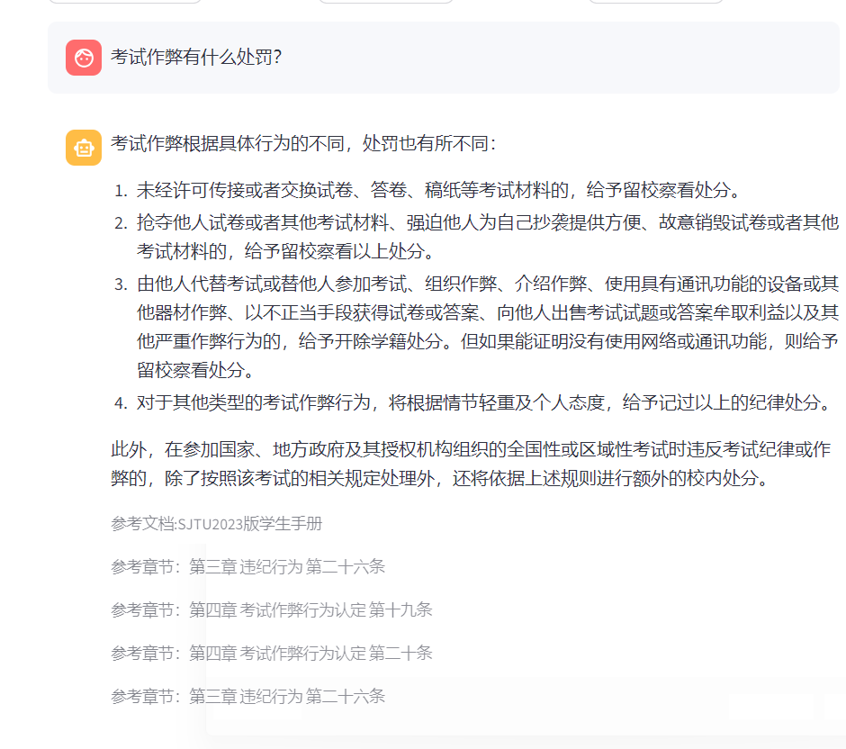

# 🤖基于RAG的学校规章制度问答机器人

## 项目背景

本项目旨在开发一个基于RAG的问答机器人。通过利用学生手册的全面内容，该机器人能够以自然语言回答学生关于学校规章制度的问题。这有助于学生便捷地获取准确、相关的信息，解决常见的疑虑，并提升对学校制度的了解。

## 环境依赖

- python 3.10.16 

- langchain-core 0.3.44

- conda 24.5.0

  其他见requirements_conda.txt

  下载环境：

  ```
  conda create --name new_env --file requirements_conda.txt
  ```

## 数据集说明

本项目的主要数据集是**上海交通大学2023年版学生手册**（题目要求的重邮学生手册没找到，就选了其他学校能找到的学生手册）

分为PDF和markdown两种形式

### **数据获取**

交大教务网站获取文档PDF版本，然后用AI提取的PDF内容生成的markdown版本

### **数据准备**

一、`data_clean_3.ipynb`

1.用langchain加载pdf

2.逐页读取，对内容进行清洗

3.抽取文档整体元数据，内容结构化

4.再次进行清洗，输出json文件

二、`json_to_chunk.ipynb`

1.将内容、子项等组合成完整内容

2.添加元数据（指明来源）

3.将文本段落分割

4.输出分割后的json文件

三、`chunk_to_embedding.ipynb`

1.接入通义文本向量模型用于向量化（text-embedding-v1）

2.分批处理进行嵌入

3.将数据存储在Chroma向量数据库并保存

## 运行流程

###### （rag_chatbot_6.py）

1.初始化与导入模块

2.加载已经保存好的向量库与LLM

3.定义提示模板和链

4.初始化会话状态

5.设置ui（侧边栏，主页面）

6.处理用户输入

7.检索向量库的相关条目

8.生成回答

9.更新对话历史

## 运行命令

进入对应的虚拟环境后

```
streamlit run "你的rag_chatbot_6.py的路径"
```

## 结果示例


其他示例见项目文件夹data和vidoes

## 运用的模型

**embedding model**：qwen的text-embedding-v1

**LLM**:qwen-max

## 完成情况

#### 增强功能

- 使用不同的文档格式
- 引入简单的UI
- 支持用户交互页面
- 输出结果可解释

#### 高级功能

- 多轮对话与上下文保持
